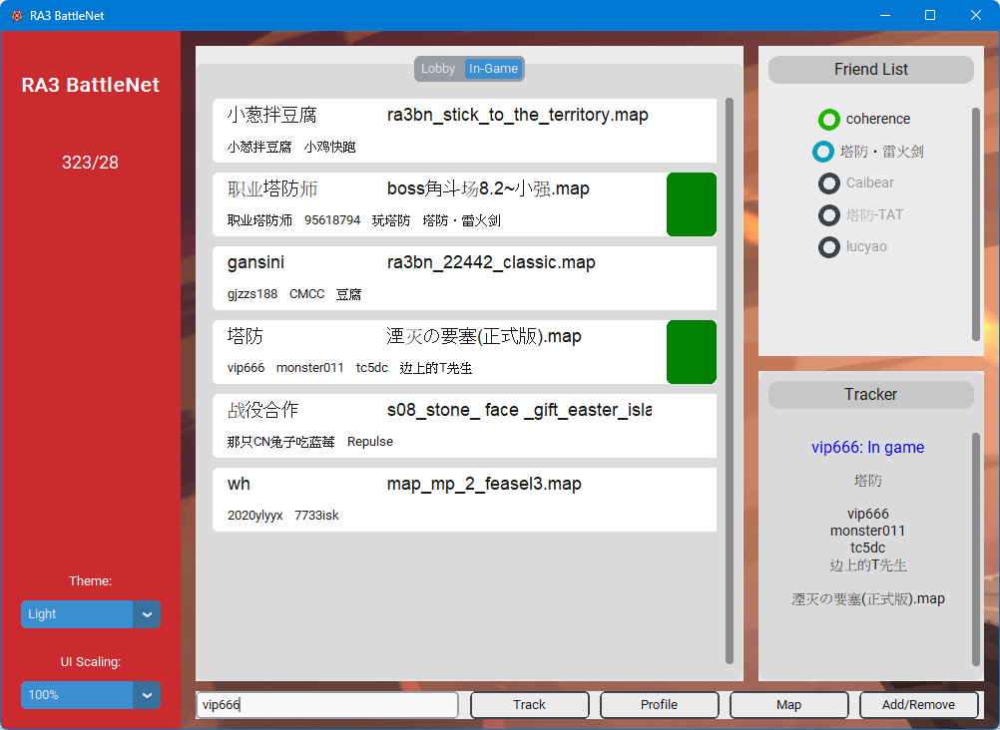

# ra3battlenet-checker
A desktop GUI that display info of staging/in-game rooms in real time.

Data is fetched from https://api.ra3battle.cn/api/server/status/detail

- - - -
Other functionalities:
* Highlight game room with matching keywords
* Player status tracking
* Friend (display idle/in-game/offline status)
* Map downloader (Require map json in prior)
* Check profile (redirect to player's profile in browser)

- - - -
Screenshots:
